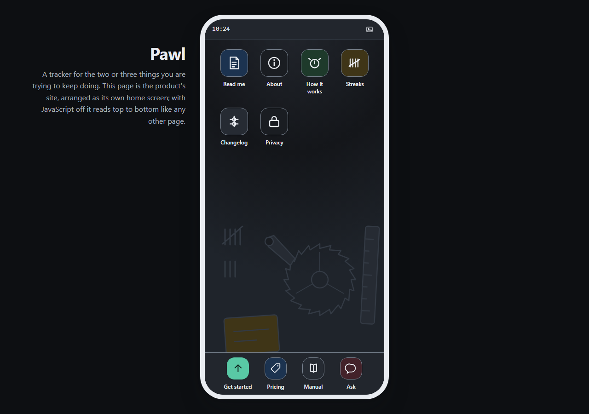
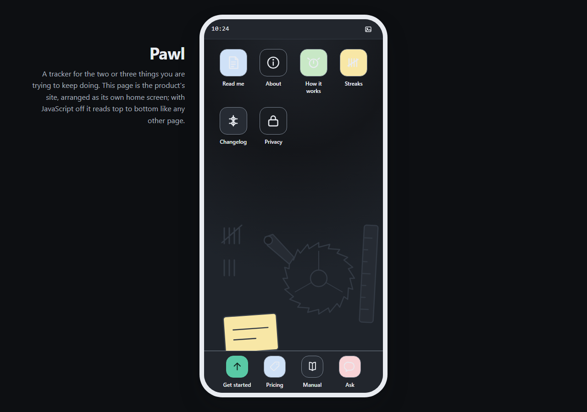

# Customizing: move along an axis

Most themes document customization as a list of variables you may set. That tells you what is editable and nothing about what to edit. This file documents it the other way round: pick the axis you want to move along, and change the few tokens that carry the move.

The axes are the four from the [creative direction framework](https://rampstack.co/framework/creative-direction), and they are the same four annotated throughout [`tokens/tokens.css`](tokens/tokens.css). Where this theme currently sits:

| Axis | Position |
| --- | --- |
| Tone register | [Playful](https://rampstack.co/framework/tone/playful) |
| Aesthetic philosophy | [Polished Standard](https://rampstack.co/framework/aesthetic/polished-standard) |
| Audience relationship | [Peer](https://rampstack.co/framework/relationship/peer) |
| Sensory ambition | [Considered](https://rampstack.co/framework/sensory/considered) |

One thing makes this file different from its siblings in the collection: this theme is a shell, and a shell is orthogonal to its skin. The status bar, the app plates, the dock, the sheets and the device frame read every surface, border and shadow from `tokens/tokens.css`, so the launcher survives any recolor you give it. That is the collection's shells and registers thesis in one sentence: an archetype supplies the furniture, a register supplies the finish, and either can change without the other noticing. Move 1 proves it, and it also shows the one place this particular shell makes the proof harder than its desktop sibling did.

Every move below is an edit to `tokens/tokens.css` only. Nothing else in the repo changes, because nothing else in the repo holds a value.

---

## Move 1, worked: re-skin the launcher to the night register

The shipped register is a calm cool-paper phone: light ground, white sheets, one deep green accent. This move takes the same launcher to night: near-black grounds, a lighter phosphor green, chrome that recedes. Same grid, same dock, same sheets, same wallpaper scene, lights off.

Sixteen tokens carry it, and the four at the end are the interesting part. Every ratio below is measured, and every text pairing clears WCAG AA.

```diff
- --ph-ground: #e9ecf1;
+ --ph-ground: #14161a;         /* ink on ground 15.29:1 */
- --ph-stage: #d8dde5;
+ --ph-stage: #0d0f12;          /* the table at night */
- --ph-scene: #d3d9e2;
+ --ph-scene: #1f242b;          /* still decorative texture */
- --ph-surface: #ffffff;
+ --ph-surface: #1a1d22;        /* ink on surface 14.27:1 */
- --ph-chrome: #f4f6f9;
+ --ph-chrome: #22262d;         /* ink-muted on chrome 6.93:1 */
- --ph-surface-muted: #e3e7ee;
+ --ph-surface-muted: #262b33;  /* ink-muted 6.50:1, the worst text pairing here */
- --ph-ink: #14171c;
+ --ph-ink: #e9ecf1;
- --ph-ink-muted: #545c68;
+ --ph-ink-muted: #a7b0bd;      /* 7.72:1 on surface, 8.27:1 on ground */
- --ph-accent: #0f6b58;
+ --ph-accent: #59c9a5;         /* 8.31:1 on surface, 8.90:1 on ground */
- --ph-accent-ink: #ffffff;
+ --ph-accent-ink: #10231d;     /* dark ink on the light accent, 8.06:1 */
- --ph-border: #c6cdd8;
+ --ph-border: #333a44;
- --ph-border-strong: #737b88;
+ --ph-border-strong: #78828f;  /* 4.34:1 on surface, 3.65:1 on surface-muted, clears the 3:1 UI floor everywhere */
- --ph-fill-success: #c8e8c6;
+ --ph-fill-success: #1e3a2b;   /* ink on fill 10.46:1 */
- --ph-fill-info: #cfe1f7;
+ --ph-fill-info: #1c3350;      /* 10.82:1 */
- --ph-fill-warning: #f8e7a6;
+ --ph-fill-warning: #3f3517;   /* 10.23:1 */
- --ph-fill-danger: #f8d3d6;
+ --ph-fill-danger: #43222a;    /* 11.81:1 */
```



### The four fills are not optional here, and that is a shell finding

In a register theme the semantic fills are badge paint. Miss them in a dark re-skin and a few badges go wrong. In this theme they are also the app plate tints, which means they are load-bearing chrome: six of the ten icons on the home screen are painted with them, and every glyph on top is drawn in `--ph-ink`.

So flipping the ink to cream while leaving the fills pale does not produce a few bad badges. It produces a home screen whose icons are gone. Here is that exact failure, captured rather than described, by running the same move and stopping after twelve tokens:



Cream ink on the shipped pale fills measures **1.12:1** on success and info, **1.04:1** on warning and **1.16:1** on danger. Nothing in the browser will warn you; the plates still render, and at a glance the screen looks like a dark theme that happens to be a bit washed out in places. It is worth knowing that the wallpaper's warning-filled card gives the same tell, which is the cheapest way to spot the mistake in a screenshot.

The general rule for any shell: work out which tokens your chrome consumes before you re-skin, not after. A shell spends tokens in places a register theme never does.

### Two more things to check after any dark re-skin

1. **The shadows.** The `rgba(20, 23, 28, ...)` components in the shadow tokens are the light theme's ink. On a near-black stage an ink shadow still works, but it works by darkening the seam rather than by reading as a cast shadow; deepen the alphas a step if the device stops separating from the table.
2. **The bezel.** Above the device breakpoint the phone's body is painted with `--ph-ink`, so this move gives you a white-bodied phone on a dark table, which is what the capture above ships and is a real handset. If you want a black phone instead, that one is not a token edit: point `.ph-device`'s background at `--ph-stage` in `shell.css`, or add a `--ph-device-body` token and reference it from both files.

<!-- Both captures above are reproducible. From the repository root, with
     playwright installed: run the hero capture command from README.md with a
     style injected after goto and before the screenshot.

     For assets/reskin.png, the injected style is Move 1's diff verbatim:

       await p.addStyleTag({ content: ':root {' +
         '--ph-ground:#14161a; --ph-stage:#0d0f12; --ph-scene:#1f242b;' +
         '--ph-surface:#1a1d22; --ph-chrome:#22262d; --ph-surface-muted:#262b33;' +
         '--ph-ink:#e9ecf1; --ph-ink-muted:#a7b0bd; --ph-accent:#59c9a5;' +
         '--ph-accent-ink:#10231d; --ph-border:#333a44; --ph-border-strong:#78828f;' +
         '--ph-fill-success:#1e3a2b; --ph-fill-info:#1c3350;' +
         '--ph-fill-warning:#3f3517; --ph-fill-danger:#43222a; }' });

     For assets/reskin-trap.png it is the same string with the four
     --ph-fill-* declarations removed, which is the twelve-token stop.

     Three consecutive runs produce the same SHA-256 for each; the committed
     PNGs are those hashes, recorded in the PR that introduced them. -->

### What happens to the feel

Nothing moves, and everything changes. The four-column grid, the honest back control, the Escape behavior, the dock and the whole wallpaper mechanism are exactly where they were, which is the proof that the shell and the register are separate layers: the ratchet wheel and the tally marks in the wallpaper are inline SVG painted through the same tokens, so they went dark without being touched. What changes is when the phone belongs to you. The cool paper reads as a phone on a desk at eleven in the morning; the night register reads as the same phone at the other end of the day, which for a tracker is when it actually gets opened.

---

## Move 2, sketched: Tone register, Playful toward Professional

The move to make if the launcher's wit fits your product but the copy's wit does not: an internal tool, a status page, anything read under deadline.

The tokens that carry it:

- `--ph-weight-display`, `750` down to `700`. The display weight is most of the voice; headings assert instead of grinning.
- `--ph-text-display`, `2.25rem` down to `1.875rem`. Restraint in scale is the tone axis's cheapest signal, and on a 390px column it buys back a line of copy as well.
- `--ph-radius-icon`, `16px` down to `10px`. The plate radius is the single most Playful number in the file. Square the plates off and the grid reads as a launcher for something you use at work.

What three tokens cannot do: rename "Read me" or unwrite "Forward only." The tone axis runs through language before it runs through anything visual, and a token file has no opinion about a headline. Budget a copy pass alongside this move.

---

## Move 3, sketched: Sensory ambition, Considered toward Functional

For the version of this shell that fronts an actual tool people open forty times a day, where the metaphor should carry navigation and stop performing.

The tokens that carry it:

- `--ph-duration`, `180ms` to `0ms`. Sheets appear in place. The one animation was the one sensory flourish; this is the whole move's center.
- `--ph-wallpaper-quiet`, flattened to a single `var(--ph-ground)` with no gradient stops, and drop the scene SVG from your markup. A tool's home screen is a surface, not a still life.
- `--ph-shadow-device`, flattened toward `--ph-shadow-raised`. The presented device stops floating and starts sitting.

The trap in this move is deleting the plate tints too, which is the obvious next step and the wrong one. The tints are not decoration; they are how somebody finds the right icon without reading six labels. Functional means nothing performs, not that nothing communicates.

---

## Adding a token

If a move needs a value the theme does not have, add it to `tokens/tokens.css` in the group whose axis it serves, with a comment saying what it is for. Then reference it from `theme.css` and `preset.js` so both Tailwind versions see it, unless it belongs to one of the three groups those files deliberately leave unmapped, which `theme.css` explains at the top. Those two files hold no values, only references, and keeping it that way is what makes the next move a short diff.
