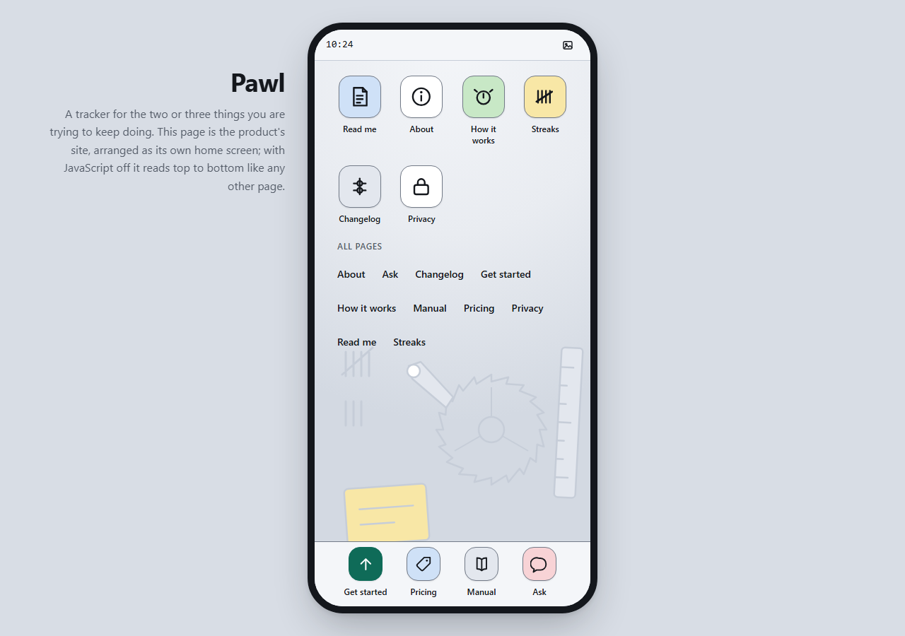

<!-- The screenshot above is a real render of demo/index.html, not a mock. If
     you change the demo, regenerate it in the same run or this README starts
     lying. The status bar clock is real, so the capture pins the clock; a
     plain screenshot command would change by the minute. From the repository
     root, with playwright installed (npm install playwright; captured on
     1.62.1):

       node -e "(async () => {
         const { chromium } = require('playwright');
         const b = await chromium.launch();
         const p = await b.newPage({ viewport: { width: 1280, height: 900 } });
         await p.clock.install({ time: new Date('2026-08-09T10:24:00') });
         await p.goto('file://' + process.cwd().replace(/\\\\/g, '/') + '/demo/index.html');
         await p.waitForTimeout(800);
         await p.screenshot({ path: 'assets/hero.png' });
         await b.close();
       })()"

     assets/mobile.png is the same command with viewport 390x844 and a click
     on .ph-apps a[href="#app-how"] before the shot. The captures are
     deterministic: three consecutive runs produce the same SHA-256, and the
     committed PNGs are those hashes (recorded in the PR that introduced
     them). -->

A phone home screen as a website: an app grid with labels, a plain text index of every page under it, a dock, a status bar with a real clock, a wallpaper system under all of it, and your pages opening as full-screen app sheets you can leave with one key. This is a **shell** archetype rather than a visual register. The register a shell wears is swappable; what this repo actually packages is the launcher.

The desktop sibling in this collection has a defining commercial exemplar to point at. This one does not. The phone-as-website idea lives in personal portfolio sites and in app landing pages that show a device, and the phrases people would use to search for it carry almost no measurable volume, which tells you what kind of thing it is: a shell that travels as a screenshot rather than as a search result. That shaped the build. The first frame has to be legible.

## The demo

The screenshot above is [`demo/index.html`](demo/index.html), a fictional personal tracker called Pawl whose pages are apps: about, how it works, pricing and the manual are icons on its home screen. That is the honesty test for a shell demo. A phone-shaped product has phone-shaped pages already, so arranging its site as a home screen describes the product instead of costuming it. A tracker you tap once a day is exactly that kind of product.

**[Open it live](https://rampstackco.github.io/phone-launcher-theme/demo/)**, or clone the repo and open the file. There is no build step, no framework, no `node_modules`, and no server to start.

The demo declares no color of its own. It links `tokens/tokens.css`, `components/components.css`, `shell/shell.css` and `shell/shell.js` and reads every value from the first of those, so it stays honest about what the theme actually produces.

There is a second page worth opening: [`components/index.html`](components/index.html) renders the five in-sheet components with the markup to copy, on an ordinary page, which is its own point: the components do not need the shell.

## Mobile is the native state, and the desktop is designed

Most responsive work starts wide and survives narrow. This one is the other way round. At 390 the launcher **is** the viewport: full bleed, four columns, dock on the bottom edge, nothing scaled down from anywhere.

The desktop is where a phone shell usually goes wrong, because there are only two honest answers and one of them is a trap. Stretching the grid wider is the trap: a full-bleed eight-column icon field at 1280, with pages opening as full-width sheets, is not a phone home screen any more. It is a desktop with icons, and [desktop-os-theme](https://github.com/rampstackco/desktop-os-theme) is already that, done properly. So this repo takes the other answer. Above 560px the launcher stops filling the viewport and becomes a device on a stage, at its true 390px width, and above 960px the masthead steps out of the screen to sit beside it, where a wide viewport has room and a phone does not. Same markup, same element, second costume.

The cost is real and worth naming: at 1280 your reading column is still 390px wide. That is the honest consequence of shipping a phone rather than a page, and it is the reason this theme suits a phone-shaped product and does not suit a documentation site.

## Position map

A visual style is a set of coordinates, not a mood. This theme sits at one point in the [creative direction framework](https://rampstack.co/framework/creative-direction), which sets brand direction on four axes. Here is where it lands and what each choice pays for.

| Axis | Position | What the position buys |
| --- | --- | --- |
| Tone register | [Playful](https://rampstack.co/framework/tone/playful) | The shell is the joke: a site that answers "where is pricing" by opening an app called Pricing. It lands in the first five seconds or not at all. |
| Aesthetic philosophy | [Polished Standard](https://rampstack.co/framework/aesthetic/polished-standard) | The app grid is the most-used interface on earth. Nobody needs an icon explained, which is what frees the metaphor to be fun instead of homework. |
| Audience relationship | [Peer](https://rampstack.co/framework/relationship/peer) | The home screen goes unexplained. Apps get names, not a tutorial; the reader has used a phone before and the interface assumes it. |
| Sensory ambition | [Considered](https://rampstack.co/framework/sensory/considered) | One animation, one accent, one wallpaper scene. The craft is visible mostly in what the launcher declines to do. |

Those four position names are the exact strings the framework uses. If you want the long version of any of them, the links go to the position page.

One of those four strains, and it is worth naming rather than hiding. A whole-site device metaphor is a loud sensory gesture, and this repo adds a second one the desktop sibling does not have: above 960px it draws a device and puts it on a stage, which is staging in the literal sense. A fair reading pushes that toward [Resonant](https://rampstack.co/framework/sensory/resonant).

It stays at Considered because of what the staging refuses to do. The device is a rounded rectangle, a bezel and a shadow, drawn from tokens: no notch, no camera, no hand holding it, no reflection, no photograph, no brand. There is no boot sequence and no unlock. Reduced motion collapses the one animation, JavaScript off removes the phone entirely and leaves a plain document, and the content survives both. Resonant work wants the reader to feel something staged for them; this wants a grin of recognition, and then it gets out of the way.

## Quick start

Clone once, then pick the path that matches what you came for. A shell theme has two different things worth taking, so the two grabs are stated separately.

```bash
git clone --depth 1 https://github.com/rampstackco/phone-launcher-theme
```

**Grab the shell.** Four files: the tokens, the in-sheet components, the chrome, the behavior. Your content goes in `ph-sheet` articles, your navigation in `ph-app` anchors; the [demo](demo/index.html) is the reference markup.

```html
<link rel="stylesheet" href="/styles/tokens/tokens.css" />
<link rel="stylesheet" href="/styles/components/components.css" />
<link rel="stylesheet" href="/styles/shell/shell.css" />
<script src="/styles/shell/shell.js" defer></script>
```

**Grab the register only.** Skip the `shell/` directory entirely and you have a calm cool-paper theme for ordinary pages: tokens plus five components, no launcher anywhere. This is the grab where this repo behaves exactly like the register themes in the collection.

```html
<link rel="stylesheet" href="/styles/tokens/tokens.css" />
<link rel="stylesheet" href="/styles/components/components.css" />
```

**Tailwind v4.** One import. `theme.css` pulls in `tokens.css` and maps it onto Tailwind's theme namespaces, so you get `bg-ph-accent`, `shadow-ph-device`, `rounded-ph-icon`, `h-ph-dock`. The shell files are plain CSS and JS either way; the adapter covers the tokens.

```css
@import "tailwindcss";
@import "./styles/tokens/theme.css";
```

**Tailwind v3.** Load the tokens in your stylesheet, then register the preset.

```css
@import "./styles/tokens/tokens.css";
@tailwind base;
@tailwind components;
@tailwind utilities;
```

```js
// tailwind.config.js
module.exports = {
  presets: [require("./styles/tokens/preset.js")],
  content: ["./src/**/*.{html,js,jsx,ts,tsx}"],
};
```

## No JavaScript, no problem

The demo is a plain document that a script upgrades, not an app with a fallback. With JavaScript disabled it reads top to bottom: a masthead, the app icons as a row of anchor links, the All pages index under them unchanged, every app as a titled card in reading order, the dock as a footer nav that jumps to the pinned four. This is verified by loading the page with scripts off, not assumed. The mechanism is one class: `shell.js` puts `ph-live` on the root element as its first act, and every launcher behavior in `shell.css` is scoped under it.

Two things are missing from that document on purpose. The back control and the home bar do not exist in the markup at all; the script injects them, because a control that does nothing must not exist. And the status bar does not render, because a status bar on a page that is not a phone is chrome about nothing.

`shell.js` is one file of vanilla JavaScript with zero dependencies, annotated section by section, small enough to read over coffee. It is the whole shell, and it is shorter than the desktop sibling's, because a phone shows one app at a time and that deletes an entire window manager.

## Accessibility is the differentiator

A fake phone that strands a keyboard user is a failed build, so the keyboard model is the part of this theme that got the most engineering:

- **The icons are not the only way through.** Under the grid, All pages: ten plain text links in alphabetical order, one per app, complete and identical whether or not the script runs. The grid and the dock are both icon surfaces, and an icon with a label under it is still an icon; a reader who does not read a screen of glyphs as navigation needs ordinary links rather than a better-drawn glyph. This is [WCAG 2.4.5 Multiple Ways](https://www.w3.org/WAI/WCAG22/Understanding/multiple-ways) on purpose rather than by luck, and it is class decision 44. Alphabetical rather than the grid's order, because a second surface that lists the same things in the same sequence is a copy of the first rather than another way in.
- Every app icon, dock icon, index link and injected control is keyboard-reachable with a visible focus ring drawn from the accent.
- The full Tab cycle was walked and recorded at both viewports, on the home screen and inside an open app. No focus trap anywhere; the cycle wraps.
- <kbd>Escape</kbd> closes the open app. One key, one rule, and unlike a window pile there is only ever one thing it could mean.
- Closing an app returns focus to the icon that opened it, verified at 390 and at 1280.
- There are two ways out of an app and both are real controls: the back control in the header and the home bar at the bottom of the screen. The bottom one exists because on an 844px screen the top-left corner is the furthest point on the device from a thumb.
- Opening an app removes the home screen from the render tree rather than covering it, so a keyboard user is never tabbing through icons nobody can see.
- App sheets carry `role="dialog"` with a real label and no `aria-modal`, because nothing is modal: the status bar stays reachable behind the sheet, and claiming otherwise would be a lie about the one thing a screen reader user would act on. All of this ARIA is added by the script at enhance time, so the plain document never claims semantics it cannot honor.
- `prefers-reduced-motion` collapses the one animation to instant through the tokens, not through a bolted-on override.

## Where the reasoning lives

[`tokens/tokens.css`](tokens/tokens.css) is the single source of truth. Every literal value in the theme appears there exactly once; `theme.css` and `preset.js` hold no values of their own and point back at it with `var()`. The file is annotated by framework axis, contrast ratios in the comments are measured, and the launcher geometry (status bar height, dock height, plate size, grid columns, bezel) is a token group like any other, which is what keeps a re-skin a one-file edit.

[`shell/shell.css`](shell/shell.css) and [`shell/shell.js`](shell/shell.js) draw the launcher from those tokens. The behavior is deliberately small: one app at a time, two honest ways to leave it, a wallpaper switch, and a clock. There is no app switcher, no folders, no page dots, no swipe. Every one of those absences is a decision with a reason, and the reasons are in the pull request that introduced this repo.

The home screen ground is a wallpaper slot, not a color. Two variants ship: the quiet field, a light from the top of the screen settling toward the bottom edge, which is what the plain document and `prefers-contrast: more` both get, and the scene, Pawl's own mechanism drawn as line art, a ratchet wheel with the pawl resting in a tooth, a column of tally marks, a notched rule and a labelled card, drawn as inline SVG so it reads the tokens like everything else. A status bar button switches them; the switch is one `data-wallpaper` attribute on the body, all styling attribute-scoped in `shell.css`, and the script only toggles the attribute. The wallpaper's paint set is restricted by rule to the light tokens, so the worst text-over-wallpaper pairing on the home screen measures 11.23:1 and no variant needs a scrim; the numbers are in the shell.css comment.

The launcher's color is worth one more sentence, because it is where a phone shell would normally reach for a second palette. It does not have one. Five of the demo's ten app plates are tinted with the four semantic fills the theme already ships for badges, each under full-strength ink glyphs; four take a plain or muted surface instead; and exactly one wears the accent, the app that is the site's actual conversion. That decision has a consequence for retheming, because it turns badge paint into structural chrome, and [CUSTOMIZE.md](CUSTOMIZE.md) shows the consequence with two pictures, one of them a failure left in on purpose.

**Consuming this from a Claude skill.** The [`design-standards`](https://github.com/rampstackco/claude-skills/tree/main/skills/design-standards) skill asks for a project's design tokens as a required input and offers to define a working set when none exist. Point it at `tokens/tokens.css` instead. The file covers every category the skill asks for, in the order it asks, and the contrast ratios are already in the comments.

## Adjacency: this is not desktop-os-theme

[desktop-os-theme](https://github.com/rampstackco/desktop-os-theme) is the other shell in this collection and the pilot this one clones its structure from: same `shell/` layout, same enhance-time ARIA doctrine, same wallpaper mechanism, same token discipline. The difference is the machine. That repo gives you a window pile you can cascade, minimize and raise, on a desktop that is designed at 1280 and transforms down. This one gives you one app at a time on a screen that is designed at 390 and is presented, not stretched, above it. If your content wants several things open side by side, go there. If your content is a column that someone reads on a phone, you are in the right repo.

## The other shells

Four repositories build shells. All four ship the same anatomy, and they differ in the machine.

- **[retro-desktop-theme](https://github.com/rampstackco/retro-desktop-theme) is the pilot's own era pair**: the same window manager wearing 1995, beveled silver chrome on a teal ground. It and desktop-os-theme are the same shell at two temperatures, and each repo's CUSTOMIZE.md runs the road between them in one direction.
- **[game-console-ui-theme](https://github.com/rampstackco/game-console-ui-theme) is the far end of the input question this repo also answers.** This one is built for a thumb at arm's length; that one is built for a remote control across a room, with arrow keys reading live geometry to move a ring between tiles. Between them they cover the two cases where a mouse is not present.

**The class-decision log for all four lives in the pilot: [`docs/class-decisions.md`](https://github.com/rampstackco/desktop-os-theme/blob/main/docs/class-decisions.md).** This repo filed items 30 to 36 there, including the states-by-viewports rule and the clipping-container finding that came out of the defect PR #2 fixed.

## License and questions

MIT. See [LICENSE](LICENSE). Use it commercially, fork it, rename the tokens, ship it. No attribution required.

Issues and pull requests are welcome here. For questions, ideas, and anything conversational, use [the discussions on the claude-skills repo](https://github.com/rampstackco/claude-skills/discussions), which is where all discussion for these repos lives.
